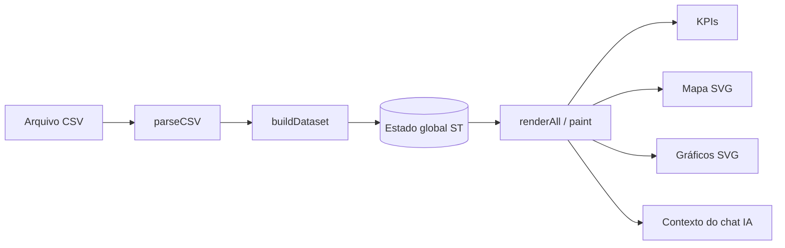

# Documentação técnica · Dashboard Nitro

Documentação de engenharia do **Observatório Global de Consumo Alcoólico** da Nitro
(divisão da *Deixa Comigo Bebidas*). O entregável é um **único arquivo**:
[`Dashboards/index.html`](../Dashboards/index.html) — sem build, sem dependências de
runtime, aberto direto no navegador.

> [!NOTE]
> Esta documentação é mantida por um agente automático (`docs-site-nitro`) e reflete o
> estado do código em `Dashboards/index.html`. Toda afirmação aqui é rastreável a uma
> linha do fonte; o que não pôde ser confirmado está marcado com `> [!WARNING] Não verificado`.

## Como o projeto funciona em uma frase

Você arrasta um CSV, o parser tolerante monta um dataset em memória (`ST`), e todo o painel
— KPIs, mapa coroplético, matriz de correlação, dispersão, ranking, histograma e tabela —
é repintado em SVG puro a cada mudança de filtro, sem botão "Aplicar".



## Mapa de navegação

### Arquitetura
- [Visão geral](arquitetura/visao-geral.md) — o app single-file, decisões e trade-offs.
- [Fluxo de dados](arquitetura/fluxo-de-dados.md) — CSV → parser → estado → render.
- [Módulos](arquitetura/modulos.md) — inventário dos blocos de JS e responsabilidades.
- Decisões de arquitetura (ADRs):
  - [ADR-0001 — App de arquivo único, zero dependências](arquitetura/decisoes/ADR-0001-arquivo-unico.md)
  - [ADR-0002 — Agendador de render com desvio para aba oculta](arquitetura/decisoes/ADR-0002-render-scheduler.md)
  - [ADR-0003 — Formulário de suporte grava no Supabase](arquitetura/decisoes/ADR-0003-suporte-supabase.md)

### Referência
- [Funções internas](referencia/funcoes.md) — assinatura, parâmetros, retorno, efeitos.
- [Estruturas de dados](referencia/estruturas-de-dados.md) — shape do dataset, `ST`, invariantes.
- [Schema do CSV](referencia/csv-schema.md) — colunas esperadas, tipos, validações, exemplos.
- [Configuração](referencia/configuracao.md) — variáveis do `.env`, chaves, defaults.
- [Integrações](referencia/integracoes.md) — Gemini, OpenWeatherMap e Supabase.

### Guias
- [Primeiros passos](guias/primeiros-passos.md) — rodar local, servir por HTTP, carregar dados.
- [Desenvolvimento](guias/desenvolvimento.md) — convenções, como adicionar um gráfico/KPI.
- [Deploy](guias/deploy.md) — publicação e hardening.
- [Troubleshooting](guias/troubleshooting.md) — sintoma → causa → correção.

### UI
- [Componentes](ui/componentes.md) — KPIs, mapa, gráficos, filtros, chat e clima.
- [Design system](ui/design-system.md) — tokens de cor, tipografia, espaçamento, breakpoints.

### Operação
- [Runbook](operacao/runbook.md) — operação do dia a dia.
- [Segurança](operacao/seguranca.md) — tratamento de chaves e superfícies de risco.

### Histórico
- [CHANGELOG-DOCS](CHANGELOG-DOCS.md) — histórico das execuções deste agente.

## Convenções desta documentação

| Convenção | Significado |
|---|---|
| `` `Dashboards/index.html:123` `` | Referência a arquivo-fonte e linha (as linhas se deslocam a cada edição). |
| `> [!NOTE]` / `> [!TIP]` / `> [!WARNING]` | Callouts de nota, dica e alerta. |
| `> [!WARNING] Não verificado` | Afirmação que não pôde ser confirmada no código. |
| Diagramas ```mermaid``` | Arquitetura, fluxos e sequências. |

> [!TIP]
> Para localizar uma seção no fonte, use os banners de comentário:
> `grep -n "^/\* =\|^<!-- =" Dashboards/index.html`.

## Fontes de verdade fora de `docs/`

| Arquivo | Papel |
|---|---|
| [`Dashboards/index.html`](../Dashboards/index.html) | O entregável — todo o código. |
| [`CLAUDE.md`](../CLAUDE.md) | Regras de manutenção e armadilhas conhecidas. |
| [`README.md`](../README.md) | Visão de produto e instruções de uso. |
| [`.env.example`](../.env.example) | Modelo das chaves de API. |
| [`Dados/drinks.csv`](../Dados/drinks.csv) | Amostra de dados (193 países × 4 métricas). |
</content>
</invoke>
