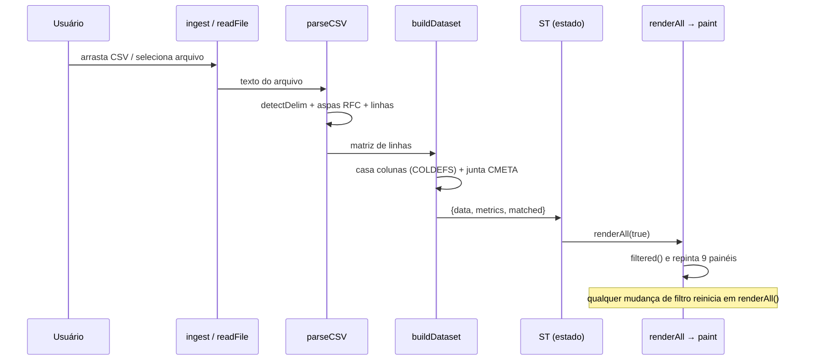
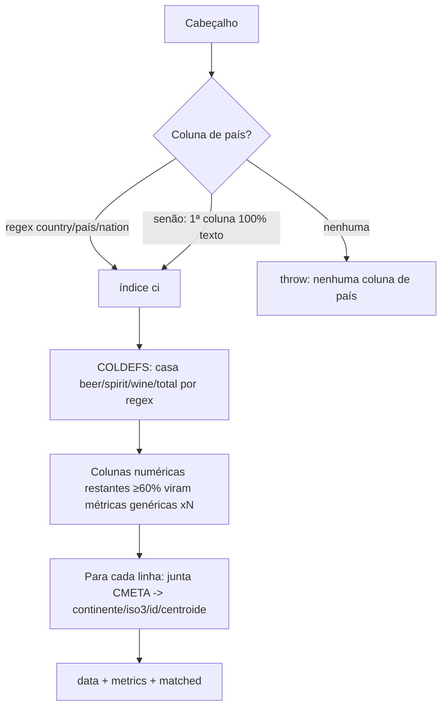
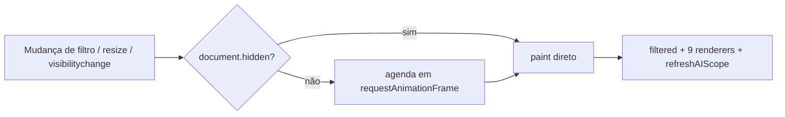

# Arquitetura — Fluxo de dados

## Sumário
- [Pipeline principal](#pipeline-principal)
- [Etapa 1 — Ingestão](#etapa-1--ingestão)
- [Etapa 2 — Parsing](#etapa-2--parsing)
- [Etapa 3 — Montagem do dataset](#etapa-3--montagem-do-dataset)
- [Etapa 4 — Estado e filtragem](#etapa-4--estado-e-filtragem)
- [Etapa 5 — Ciclo de render](#etapa-5--ciclo-de-render)
- [O contexto do chat também deriva de filtered()](#o-contexto-do-chat-também-deriva-de-filtered)
- [Referências cruzadas](#referências-cruzadas)

## Pipeline principal

A cadeia canônica (documentada em `CLAUDE.md` e verificada no código):

```
readFile → parseCSV → buildDataset → ST → renderAll → paint
```



## Etapa 1 — Ingestão

Três portas de entrada, todas terminando em `ingest()` (`index.html:1323`):

| Porta | Trecho | Observação |
|---|---|---|
| Drag-and-drop | `index.html:1376-1387` | Funciona por `file://`. Se o dashboard já está aberto, reexibe o intake. |
| Botão "Selecionar arquivo" | `index.html:1362-1363` | Dispara o `<input type=file>`. Atalho `Ctrl/⌘+O` (`index.html:2169`). |
| Botão "Carregar ../Dados/drinks.csv" | `index.html:1364-1373` | Usa `fetch`; **falha por `file://` (CORS)**, funciona via HTTP. |

`readFile` usa `FileReader.readAsText(f, 'utf-8')` e chama `ingest` no `onload`
(`index.html:1353-1359`).

## Etapa 2 — Parsing

`parseCSV(text)` (`index.html:1149`) é uma máquina de estados de leitura caractere a caractere:

1. Remove BOM (``) e normaliza `\r\n?` → `\n` (`index.html:1150`).
2. `detectDelim` escolhe entre `, ; \t |` contando ocorrências no cabeçalho (`index.html:1140-1148`).
3. Respeita aspas RFC (`""` vira `"` literal) (`index.html:1156`).
4. Descarta linhas totalmente vazias (`index.html:1164`).

`toNum(v)` (`index.html:1166`) normaliza decimais:

| Entrada | Interpretação | Saída |
|---|---|---|
| `1.234,56` | pt-BR (ponto de milhar, vírgula decimal) | `1234.56` |
| `1,234.56` | en-US (vírgula de milhar) | `1234.56` |
| `4,9` | vírgula decimal simples | `4.9` |
| `abc` / vazio | não numérico | `NaN` |

## Etapa 3 — Montagem do dataset

`buildDataset(rows)` (`index.html:1186`):



- **Casamento de colunas**: `COLDEFS` (`index.html:1179-1184`) reconhece cerveja, destilados,
  vinho e álcool puro por regex em PT e EN. Detalhes em [Schema do CSV](../referencia/csv-schema.md).
- **Colunas genéricas**: uma coluna numérica não reconhecida vira métrica `x<i>` se ≥60% das
  linhas forem finitas (`index.html:1205-1211`).
- **Deduplicação**: países repetidos são ignorados (`seen` em `index.html:1214-1218`).
- **Metadados**: cada país é casado com `CMETA[name]` para obter continente, ISO3, id numérico
  e centroide (`index.html:1219-1226`).

> [!WARNING]
> `buildDataset` lança exceção com mensagem amigável em três casos: sem cabeçalho+dados,
> sem coluna de país, sem coluna numérica. `ingest` captura e chama `showErr` (`index.html:1325-1326`).

## Etapa 4 — Estado e filtragem

`ingest` grava o resultado em `ST` e escolhe defaults: métrica em foco = `total` (ou a primeira),
eixos da dispersão X=`beer`, Y=`total` (`index.html:1328-1332`). Detalhes do shape em
[Estruturas de dados](../referencia/estruturas-de-dados.md).

`filtered()` (`index.html:1285`) aplica, em ordem: continentes selecionados → busca textual
(nome ou ISO3) → faixa mín/máx da métrica ativa, descartando valores não finitos.

## Etapa 5 — Ciclo de render



- `renderAll(first)` (`index.html:2125`) é o **agendador**; `paint(first)` (`index.html:2137`)
  é o corpo síncrono que chama os 9 renderers e `refreshAIScope`.
- Em aba oculta o `requestAnimationFrame` fica suspenso, então `renderAll` chama `paint`
  diretamente. Ver [ADR-0002](decisoes/ADR-0002-render-scheduler.md).
- Reagendamentos: `resize` com debounce de 180 ms (`index.html:2160-2165`) e
  `visibilitychange` (`index.html:2156-2158`).

## O contexto do chat também deriva de filtered()

`snapshot()` (`index.html:2424`) monta o resumo enviado ao Gemini a partir de `filtered()`.
Mudar qualquer filtro muda o que o modelo enxerga — é isso que garante o requisito de
"respeitar os filtros". Ver [Integrações](../referencia/integracoes.md).

## Referências cruzadas

- [Visão geral](visao-geral.md)
- [Módulos](modulos.md)
- [Funções internas](../referencia/funcoes.md)
- [Estruturas de dados](../referencia/estruturas-de-dados.md)
- [Schema do CSV](../referencia/csv-schema.md)
</content>
