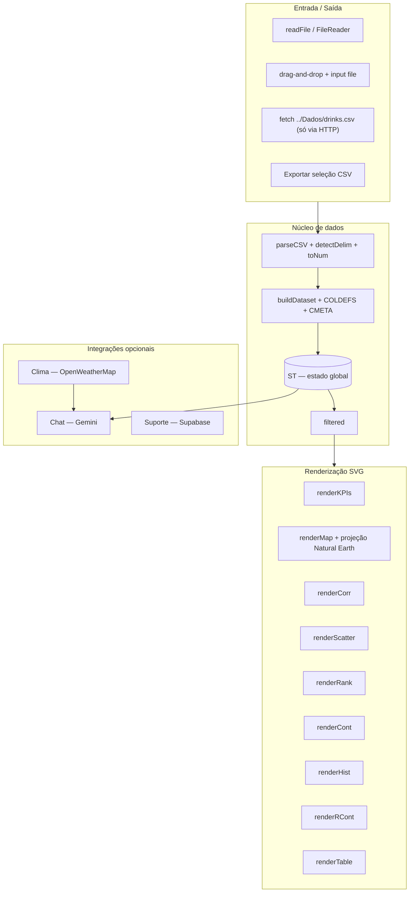

# Arquitetura — Visão geral

## Sumário
- [O que é](#o-que-é)
- [Princípios não-negociáveis](#princípios-não-negociáveis)
- [Camadas internas](#camadas-internas)
- [Anatomia do arquivo único](#anatomia-do-arquivo-único)
- [Trade-offs assumidos](#trade-offs-assumidos)
- [Dependências externas](#dependências-externas)
- [Referências cruzadas](#referências-cruzadas)

## O que é

Painel analítico de consumo de bebidas alcoólicas por país. Todo o produto vive em
`Dashboards/index.html` (~2.778 linhas): HTML, CSS e JavaScript inline no mesmo arquivo,
sem build step e sem `<script src>`/`<link>` para bibliotecas. O mapa, a projeção
cartográfica, as escalas de cor, a estatística e as animações são **implementados à mão**.

O único CSS externo é a folha do Google Fonts (Poppins, com fallback de sistema) em
`Dashboards/index.html:10`.

## Princípios não-negociáveis

Extraídos de [`CLAUDE.md`](../../CLAUDE.md) e confirmados no código:

| Princípio | Consequência no código |
|---|---|
| **Nada de dado mocado** | Todo número exibido vem do CSV importado em runtime. Só metadados de referência são embutidos: `NITRO_LOGO_W/D`, `NITRO_MARK`, `WORLD`, `CMETA` (`index.html:989-993`). |
| **Mínimo de interações** | Qualquer filtro repinta na hora; não existe botão "Aplicar". Ver `onRange`, `buildControls` (`index.html:1400-1481`). |
| **Arquivo único** | Zero dependências de runtime. Ver banner em `index.html:995-1000`. |
| **Marca Nitro** | Tokens CSS `:root` em `index.html:18-42`. |
| **UI em pt-BR** | `Intl.NumberFormat('pt-BR')` em `index.html:1019-1021`. |

## Camadas internas

- **IO**: `readFile` (`index.html:1353`), listeners de drag-and-drop (`index.html:1376-1387`),
  botão de amostra via `fetch` (`index.html:1364-1373`) e exportação (`index.html:1389-1398`).
- **Núcleo**: `parseCSV` (`index.html:1149`) → `buildDataset` (`index.html:1186`) → `ST`
  (`index.html:1271`) → `filtered()` (`index.html:1285`).
- **View**: agendador `renderAll` + corpo `paint` (`index.html:2125-2154`).
- **Integrações**: clima (`index.html:2289`), chat (`index.html:2396`), suporte (`index.html:2172`).

## Anatomia do arquivo único

Mapa de faixas aproximado (as linhas se deslocam conforme edições):

| Faixa | Conteúdo |
|---|---|
| `index.html:11-659` | `<style>`: tokens `:root`, HEADER, INTAKE, DASHBOARD, breakpoints. |
| `index.html:661-985` | Markup: HEADER → INTAKE → DASHBOARD → SUPORTE (modal) → CHAT → `#tip`. |
| `index.html:989-993` | Dados embutidos gigantes: `NITRO_LOGO_W/D`, `NITRO_MARK`, `WORLD`, `CMETA`. **Não abrir/reformatar.** |
| `index.html:1003-1137` | UTIL: helpers DOM, `Intl`, estatística `S`, cores, animações. |
| `index.html:1139-1233` | CSV PARSING: `detectDelim`, `parseCSV`, `toNum`, `COLDEFS`, `buildDataset`. |
| `index.html:1235-1268` | TOPOJSON + PROJEÇÃO: `decodeArcs`, `topoFeatures`, `neRaw`, `projectRaw`. |
| `index.html:1270-1316` | ESTADO (`ST`), `filtered`, tooltip. |
| `index.html:1318-1398` | INTAKE / IO: `ingest`, `readFile`, drag-and-drop, exportação. |
| `index.html:1400-1481` | CONTROLES: filtros, faixa, busca, reset. |
| `index.html:1482-2121` | KPIs, MAPA, MATRIZ, DISPERSÃO, RANKING, CONTINENTE, HISTOGRAMA, r POR CONTINENTE, TABELA. |
| `index.html:2123-2170` | RENDER: `renderAll`, `paint`, listeners globais. |
| `index.html:2172-2235` | SUPORTE (Supabase). |
| `index.html:2237-2394` | CHAVES (`.env`) e CLIMA. |
| `index.html:2396-2769` | CHAT COM IA (Gemini). |
| `index.html:2771-2775` | Boot: injeta logos. |

Detalhamento por bloco em [Módulos](modulos.md).

## Trade-offs assumidos

> [!NOTE]
> As decisões abaixo são deliberadas — não são bugs. Detalhes em cada ADR.

- **Sem build, sem bibliotecas** → mapa, projeção e estatística reimplementados. Ganha-se
  portabilidade (abre por `file://`) e perde-se ecossistema (D3, Chart.js). Ver
  [ADR-0001](decisoes/ADR-0001-arquivo-unico.md).
- **`fetch` do `.env` e do CSV de amostra** falha por `file://` (CORS). É esperado; servir
  por HTTP resolve. Ver [Troubleshooting](../guias/troubleshooting.md).
- **Chaves no cliente**: `.env` e a publishable key do Supabase chegam ao navegador em texto
  claro. É um painel interno. Ver [Segurança](../operacao/seguranca.md).
- **Render síncrono via `requestAnimationFrame`** com desvio para `document.hidden`. Ver
  [ADR-0002](decisoes/ADR-0002-render-scheduler.md).

## Dependências externas

| Dependência | Tipo | Obrigatória? | Onde |
|---|---|---|---|
| Google Fonts (Poppins) | CSS | Não (há fallback de sistema) | `index.html:10` |
| Google Gemini | API REST/SSE | Não | `index.html:2403` |
| OpenWeatherMap | API REST | Não | `index.html:2352` |
| Supabase (REST) | API REST | Não (só o formulário de suporte) | `index.html:2175` |

## Referências cruzadas

- [Fluxo de dados](fluxo-de-dados.md)
- [Módulos](modulos.md)
- [Estruturas de dados](../referencia/estruturas-de-dados.md)
- [Integrações](../referencia/integracoes.md)
- [Design system](../ui/design-system.md)
</content>
