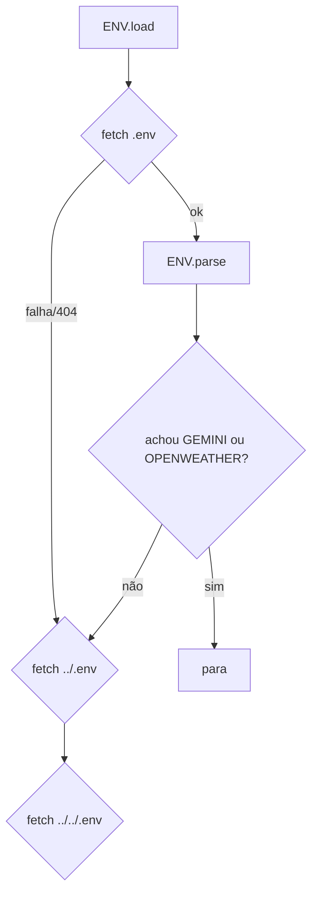

# Referência — Configuração

> [!WARNING]
> Esta página documenta apenas os **nomes** das variáveis. Nunca copie valores de segredo do
> `.env` para a documentação.

## Sumário
- [Variáveis do .env](#variáveis-do-env)
- [Como o .env é lido](#como-o-env-é-lido)
- [Fallback por localStorage](#fallback-por-localstorage)
- [Chaves e constantes embutidas no código](#chaves-e-constantes-embutidas-no-código)
- [Defaults de runtime](#defaults-de-runtime)
- [Referências cruzadas](#referências-cruzadas)

## Variáveis do .env

Modelo em [`.env.example`](../../.env.example):

| Variável | Recurso | Obtida em | Obrigatória? |
|---|---|---|---|
| `GEMINI_API_KEY` | Chat "Conversar com os dados" | https://aistudio.google.com/apikey | Não |
| `OPENWEATHER_API_KEY` | Widget de clima | https://home.openweathermap.org/api_keys | Não |

Sem chave, o recurso correspondente simplesmente não aparece/funciona; o resto do painel opera
normalmente.

## Como o .env é lido

O objeto `ENV` (`index.html:2241-2280`) lê o arquivo em runtime por `fetch`, tentando três
caminhos relativos em ordem: `.env`, `../.env`, `../../.env` (`index.html:2261`).

- Ignora respostas que começam com `<` (HTML de 404) (`index.html:2266`).
- `ENV.parse` (`index.html:2244`) ignora comentários (`#`), aceita `export`, remove aspas.

> [!WARNING]
> Por `file://` o `fetch` do `.env` é **bloqueado pelo CORS**. A leitura só funciona servindo
> o projeto por HTTP. Ver [Troubleshooting](../guias/troubleshooting.md).

## Fallback por localStorage

Quando o `.env` não é lido, `ENV.get(key)` cai para `localStorage['nitro.'+key]`
(`index.html:2274-2278`):

| Chave localStorage | Preenchida por |
|---|---|
| `nitro.GEMINI_API_KEY` | bloco `#aiKeyAsk` do chat (`index.html:2735-2742`) |
| `nitro.OPENWEATHER_API_KEY` | — (não há UI; só via `.env`) |
| `nitro.wxCity` | prompt de cidade do widget de clima (`index.html:2340-2342`) |
| `nitro.wx` | cache do último clima (TTL 15 min) (`index.html:2368`) |

## Chaves e constantes embutidas no código

> [!WARNING]
> As constantes abaixo estão **hardcoded** no HTML e chegam ao navegador em texto claro.

| Constante | Valor (tipo) | Fonte | Observação |
|---|---|---|---|
| `SUPA_URL` | URL do projeto Supabase | `index.html:2175` | endpoint do formulário de suporte |
| `SUPA_KEY` | publishable key (`sb_publishable_...`) | `index.html:2176` | protegida por RLS insert-only — ver [ADR-0003](../arquitetura/decisoes/ADR-0003-suporte-supabase.md) |
| `API` (Gemini) | `https://generativelanguage.googleapis.com/v1beta/models/` | `index.html:2403` | base do endpoint |
| `MODELS` | cadeia de fallback de modelos | `index.html:2404-2410` | ver [Integrações](integracoes.md) |

## Defaults de runtime

| Parâmetro | Default | Fonte |
|---|---|---|
| Métrica em foco | `total` (ou 1ª métrica) | `index.html:1330` |
| Eixo X da dispersão | `beer` | `index.html:1331` |
| Eixo Y da dispersão | `total` | `index.html:1332` |
| Escala do mapa | `quantile` | `index.html:1274` |
| Zoom do mapa | `{k:1,x:0,y:0}` | `index.html:1278` |
| `generationConfig` Gemini | `temperature: 0.25`, `maxOutputTokens: 8192` | `index.html:2622` |
| Cache de clima (TTL) | 15 min | `index.html:2293` |
| Timeout de geolocalização | 9 s | `index.html:2390` |
| Debounce da busca | 140 ms | `index.html:1471` |
| Debounce do resize | 180 ms | `index.html:2164` |

## Referências cruzadas

- [Integrações](integracoes.md)
- [Segurança](../operacao/seguranca.md)
- [Primeiros passos](../guias/primeiros-passos.md)
- [ADR-0003 — Suporte no Supabase](../arquitetura/decisoes/ADR-0003-suporte-supabase.md)
</content>
