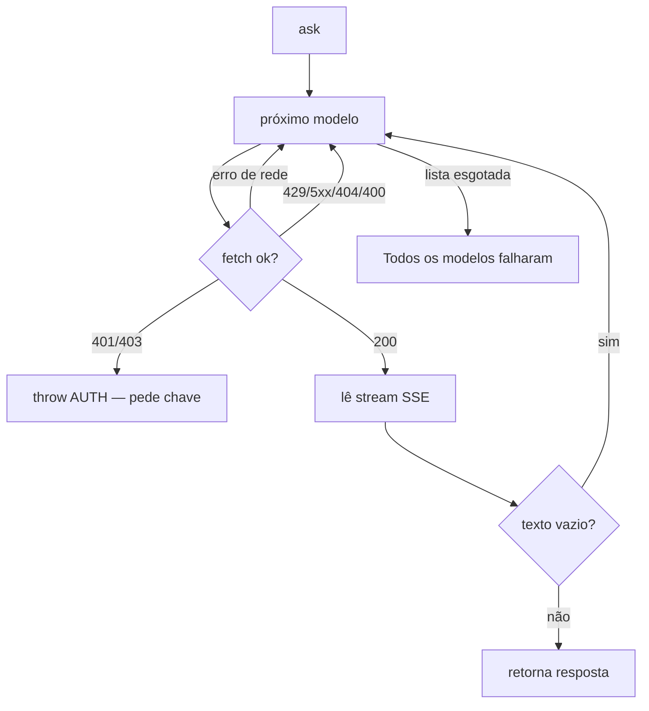
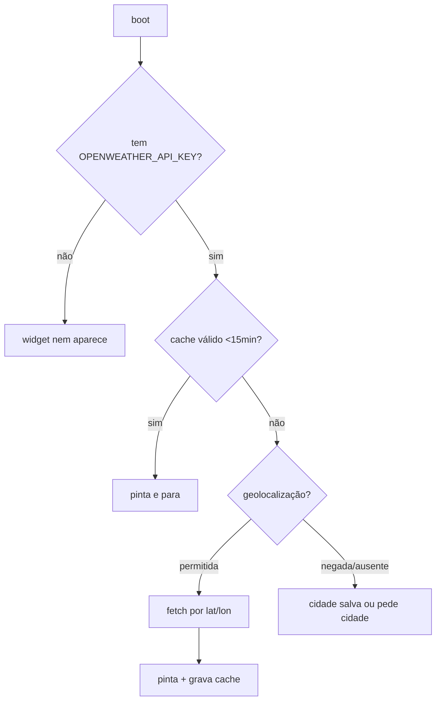

# Referência — Integrações externas

São as únicas chamadas de rede além do Google Fonts. Todas são **opcionais**: sem chave/conexão,
o painel degrada graciosamente.

## Sumário
- [Gemini (chat)](#gemini-chat)
- [OpenWeatherMap (clima)](#openweathermap-clima)
- [Supabase (formulário de suporte)](#supabase-formulário-de-suporte)
- [Referências cruzadas](#referências-cruzadas)

## Gemini (chat)

Bloco em `index.html:2396-2769`. Botão "Conversar com os dados" (`#btnAI`).

### Contrato

| Item | Valor | Fonte |
|---|---|---|
| Base | `https://generativelanguage.googleapis.com/v1beta/models/` | `index.html:2403` |
| Endpoint | `{model}:streamGenerateContent?alt=sse` | `index.html:2629` |
| Método | `POST` | `index.html:2630` |
| Auth | header `x-goog-api-key: <GEMINI_API_KEY>` | `index.html:2631` |
| Body | `{systemInstruction, contents, generationConfig}` | `index.html:2619-2623` |
| `generationConfig` | `temperature: 0.25`, `maxOutputTokens: 8192` | `index.html:2622` |

O `systemInstruction` combina o prompt `SYSTEM` (`index.html:2513-2520`) com o resumo de
`snapshot()` (contexto derivado de `filtered()`).

### Cadeia de fallback de modelos

`MODELS` é percorrido em ordem (`index.html:2404-2410`):

```
gemini-3.8-flash → gemini-3.5-flash → gemini-flash-latest
→ gemini-3.5-flash-lite → gemini-2.5-flash
```



Códigos que disparam retry: `RETRY = {429,500,502,503,504,404,400}` (`index.html:2612`).
`401/403` abortam imediatamente e pedem a chave de novo (`index.html:2642`).

### Parsing do SSE

> [!WARNING]
> O SSE do Gemini usa **CRLF**. O parser normaliza `\r\n`→`\n`, fatia por `\n\n` e consome o
> resto do buffer ao fim do stream (`index.html:2667-2672`). Sem isso a resposta chega íntegra
> e é descartada em silêncio.

Só partes com `p.text && !p.thought` são acumuladas (`index.html:2660`) — o "raciocínio" do
modelo é descartado. Por isso `maxOutputTokens` tem folga (8192): modelos com raciocínio gastam
tokens antes de emitir texto.

### Degradação

| Situação | Comportamento |
|---|---|
| Sem chave (`NOKEY`) | mostra `#aiKeyAsk`; usuário informa a chave (vai para `localStorage`) |
| Chave rejeitada (`AUTH:`) | mostra `#aiKeyAsk` com mensagem de rejeição |
| Todos os modelos falham | mensagem de erro com o último detalhe |

O histórico é mantido curto (janela de 16 mensagens, `index.html:2705`).

## OpenWeatherMap (clima)

Bloco em `index.html:2289-2394`. Widget `#wx` na barra superior.

### Contrato

| Item | Valor | Fonte |
|---|---|---|
| Endpoint | `https://api.openweathermap.org/data/2.5/weather` | `index.html:2352` |
| Params | `units=metric`, `lang=pt_br`, `appid=<OPENWEATHER_API_KEY>` + `lat/lon` ou `q` | `index.html:2351` |
| Cache | `nitro.wx` no localStorage, TTL 15 min | `index.html:2293` |

### Fluxo



- Permissão negada (ou sem HTTPS/localhost) → widget vira clicável e aceita cidade digitada,
  salva em `nitro.wxCity` (`index.html:2337-2345`).
- Erro `401` → "chave inválida"; sem chave → "Chave do clima ausente" (`index.html:2353`, `2370`).
- Some abaixo de 900 px (`index.html:551`).

### Efeito no chat

O último clima lido é exposto em `WX.last` (`index.html:2287`, `2326`) e entra no `snapshot()`
como contexto opcional — só mencionado se o usuário perguntar (`index.html:2506-2509`).

## Supabase (formulário de suporte)

Bloco em `index.html:2172-2235`. Modal do botão flutuante "Suporte".

> [!WARNING]
> Isto **contradiz** `README.md`/`CLAUDE.md`, que descrevem o suporte como maquete. O código
> envia de verdade. Ver [ADR-0003](../arquitetura/decisoes/ADR-0003-suporte-supabase.md).

### Contrato

| Item | Valor | Fonte |
|---|---|---|
| Endpoint | `{SUPA_URL}/rest/v1/support_messages` | `index.html:2213` |
| Método | `POST` | `index.html:2214` |
| Headers | `apikey`, `Authorization: Bearer <SUPA_KEY>`, `Content-Type`, `Prefer: return=minimal` | `index.html:2215-2220` |
| Payload | `{name, email, topic, message}` | `index.html:2202-2208` |
| `created_at` | default do banco | `index.html:2207` |

### Degradação

- Falha (`!r.ok` ou exceção) → mensagem "Não consegui registrar o chamado agora..." e o botão
  reabilita (`index.html:2227-2233`).
- Sucesso → "Chamado registrado! Retornamos por e-mail." e `form.reset()` (`index.html:2224-2226`).

## Referências cruzadas

- [Configuração](configuracao.md)
- [Segurança](../operacao/seguranca.md)
- [Componentes](../ui/componentes.md)
- [Troubleshooting](../guias/troubleshooting.md)
</content>
